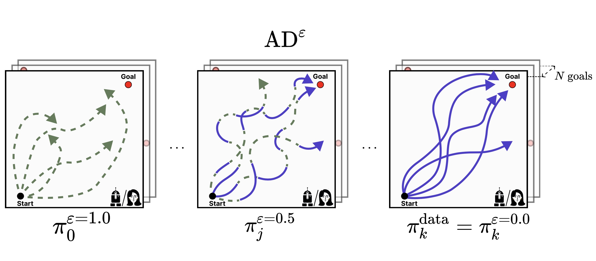

# In-Context Reinforcement Learning from Noise Distillation


This repo contains official implementation of 
[In-Context Reinforcement Learning from Noise Distillation](https://arxiv.org/abs/2312.12275). The experiments in 
different environments are separated in folders. We did this on purpose not to overload our code with unnecessary 
if-else statements depending on environment to preserve readability.

## Dependencies

The _Dark_ environments could be installed through pip or Docker, while _Watermaze_ is installed only with Docker. 
Watermaze depends heavily on the modified [dm_lab](https://github.com/google-deepmind/lab) code, so the dependencies 
are not that easily managed.

### Dark Environments
As easy as it gets, you may just install all the requirements with:

```bash
python install -r requirements.txt
```

Tested on python 3.8.

If you'd like to use Docker, then do

```bash
# implying you are in dark_room 
# or key_to_door directory
docker build -t <IMAGE_NAME> .
```

To run the code, use:

```bash
docker run -it \
    --gpus=all \
    --rm \
    --name <CONTAINER_NAME> \
    <IMAGE_NAME> bash
```

and then execute scripts.


### Watermaze

You have two options, the first one is to obtain a Docker image from DockerHub:

```bash
docker push suessmann/btd_dm_lab:1.1ad
```

The second option is to build a container yourself:

```bash
docker build -t <IMAGE_NAME> .
```

To run the scripts, use the following code:

```bash
# implying you are in the root of directory
docker run -it \ 
    --workdir /workspace \
    --rm \
    --volume ./watermaze/:/workspace/ \
    --name <CONTAINER_NAME> \
    <IMAGE_NAME> bash
```

## Running experiments

### Dark Environemnts
To run an experiment, simply run `ad_<env_name>.py` script, the data will generate automatically.

For example, if you wish to train AD$`^\eps`$ on Key-to-Door env with 50% performance from an optimal demonstrator:

```bash
python ad_dark_key20door.py --config_path="configs/ad-k2d.yaml" \
       --max_perf=0.5
```

### Watermaze

Since data for Watermaze is heavy (~500GB), we cannot provide it to you. However, you can generate it yourself, 
first you obtain demonstrator policy by running

```bash
python ppo_watermaze.py --goal_x=<x> --goal_y=<y>
```

as many times as many goals you want. Then, generate noisy trajectories with 50% performance with

```bash
# note that we provide eps=0.7 
# for max_perf=0.5
python generate_watermaze_traj.py --num_goals=<num_goals> --hist_len=<hist_len> --eps 0.7
```

and then, finally, run the training script:

```bash
python ad_watermaze.py --config_path="configs/ad-watermaze.yaml" --learning_histories_path=<path>
```

there you go!

## Citing

If you used this code for your research or a project, please cite us as:

```
@article{zisman2023emergence,
  title   = {Emergence of In-Context Reinforcement Learning from Noise Distillation},
  author  = {Ilya Zisman and Vladislav Kurenkov and Alexander Nikulin and Viacheslav Sinii and Sergey Kolesnikov},
  year    = {2023},
  journal = {arXiv preprint arXiv: 2312.12275}
}
```


